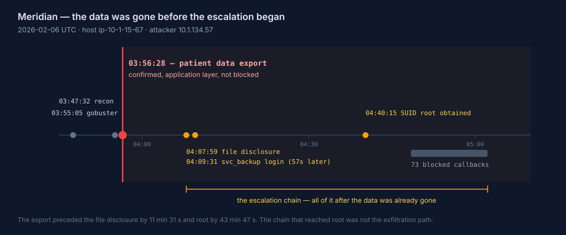
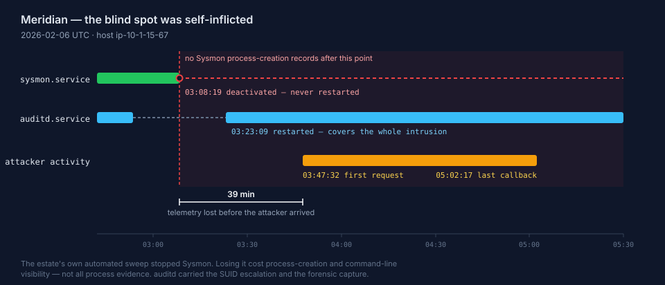

# Threat Hunt: Meridian — Healthcare Host Compromise and a Self-Inflicted Blind Spot

**Analyst:** Kekoa Giron
**Scenario:** Meridian (Hunt 25), a simulated healthcare estate — Linux web application host `ip-10-1-15-67` (`10.1.15.67`)
**Scenario clock:** 2026-02-06, 02:42 – 05:30 UTC
**Workspace:** Azure Log Analytics (`LAW-HuntPractice`), KQL across six custom tables
**Tooling:** Microsoft Sentinel / Azure Log Analytics (KQL), MITRE ATT&CK

> **Evidence standard:** Every finding below names the table, timestamp, and field it came from. Where a conclusion is inference rather than direct telemetry, it is labelled as such with a confidence level. Where the logs do not record something, I say so rather than filling the gap — including in the one place where a missing log *was* the finding.

## Summary

On 6 February 2026 an external actor scanned the Meridian healthcare web application and exported patient data through it at 03:56:28, during the content-discovery run. Eleven minutes later they used a file-disclosure flaw to read the host's account list and a database configuration file, logged in as the `svc_backup` service account 57 seconds after that, and escalated to root through a SUID shell. The estate's automated defences blocked their later command-and-control traffic and reverted most of what they left behind.

**The export did not depend on any of that.** It completed before the credential theft and 44 minutes before root was obtained. Most of this report reconstructs a chain that reached root; the data loss had already happened before that chain began.

Two things make this incident worth reading about. The response did not contain it — a masqueraded backdoor named `health_check` was flagged by the automated sweep and then left running, with effective root, through every subsequent action including the forensic capture. And the single largest gap in the evidence was not the attacker's doing: the estate's own remediation stopped Linux Sysmon 39 minutes *before* the intrusion began, eliminating process-creation and command-line visibility for the entire incident. What remained — auditd, auth, syslog and Defender records — is what the chain in this report had to be rebuilt from.



> **If you read one section, read [Analyst pivot](#analyst-pivot-re-testing-the-telemetry-gap-hypothesis).** Identifying that self-inflicted blind spot took several wrong answers first, and the reason they were wrong is the most useful thing in this report.

## Hypothesis

An external actor compromised the internet-facing Meridian web application, obtained credentials for a service account, escalated to root on the host, and exfiltrated patient data — and part of the resulting evidence gap is attributable to the estate's own automated remediation rather than to the attacker.

This is falsifiable. The hypothesis fails if:

- the reconnaissance traffic originates from an internal or authorised source
- no file-disclosure path exists into credential material
- the `svc_backup` SSH session authenticates from the developer range rather than the scanning host
- no privilege escalation is evidenced on the host
- every telemetry gap is attributable to attacker action rather than to defensive tooling

**Outcome: proved.** All five conditions are evidenced below. The final clause required the most work and is documented in *Analyst pivot* near the end.

## At a glance

| | |
|---|---|
| **Target** | `ip-10-1-15-67` (`10.1.15.67`) — Meridian healthcare web application host |
| **Attacker source** | `10.1.134.57` |
| **Reconnaissance** | `gobuster/3.8.2` — 18,454 requests, plus Nmap NSE, `curl/8.18.0`, `WhatWeb/0.6.3` |
| **Initial access** | Local file inclusion via `config_viewer.php` |
| **Credential source** | `/etc/passwd` (04:07:59), `database.conf` (04:08:34) |
| **Account abused** | `svc_backup` (uid 1001) — SSH login **57 seconds** after the config read |
| **Privilege escalation** | SUID root shell `/tmp/rootbash -p` — `auid=1001`, `euid=0`, after two failed paths |
| **Data exfiltration** | **Confirmed** — patient data export at 03:56:28 via the web application, 11 minutes *before* the credential theft |
| **Later C2 attempts** | **73 blocked** connections to `10.1.134.57:43212`, 04:48:28 – 05:02:17 |
| **Surviving persistence** | `/opt/meridian/scripts/health_check`, PID `267155`, PPID `1`, uid set `1001 0 0 0` |
| **Largest evidence gap** | Self-inflicted. `sysmon.service` deactivated at 03:08:19 and never restarted — 39 minutes before the intrusion began |

---

## 1. Establish what the defensive tooling did before blaming the attacker

The first burst of alerts in the window looks like an intrusion and is not one. At 02:53:31 Defender records SSH key modifications, crontab modifications, and new systemd services — all being reverted.

```kusto
MeridianDefender_CL
| where isnotempty(EventTime_t)
| where EventTime_t between (
    datetime(2026-02-06 02:53:25) ..
    datetime(2026-02-06 02:53:40)
)
| project EventTime_t, EventCategory_s, RawMessage_s
| order by EventTime_t asc
```

Returned: `SSH key modification -- reverting` ×4, `Crontab modification -- reverting` ×3, `New systemd service detected` ×2 — all at 02:53:31.

**Finding:** this is the estate's automated defence stack bootstrapping and reverting the host to baseline, not an attacker. The first genuine attacker activity does not appear until 03:47:32, 54 minutes later.

Also pre-intrusion: a `Full patient table query` recorded at 02:58:26 predates the first attacker request by 49 minutes and carries no attacker source address. It is not attributed to the intrusion and is treated here as baseline application activity. It is noted explicitly because it is the kind of event that invites a false early anchor.

**Why it matters:** treating either event as the intrusion would have anchored the timeline nearly an hour too early and attributed routine activity to a threat actor.

## 2. Reconstruct the reconnaissance and identify the tooling

```kusto
MeridianAccess_CL
| where ClientIp_s == "10.1.134.57"
| where EventTime_t between (
    datetime(2026-02-06 02:42:00) ..
    datetime(2026-02-06 05:30:00)
)
| summarize
    FirstSeen = min(EventTime_t),
    Requests = count()
    by UserAgent_s
| order by FirstSeen asc
```

| User agent | First seen | Requests |
|---|---|---|
| `Mozilla/5.0 (compatible; Nmap Scripting Engine; …)` | 03:47:32 | 29 |
| `-` | 03:47:32 | 4 |
| `curl/8.18.0` | 03:52:09 | 16 |
| `WhatWeb/0.6.3` | 03:54:54 | 1 |
| `gobuster/3.8.2` | 03:55:05 | 18,454 |

**Finding:** a conventional escalation of tooling — port and script scanning, manual probing, fingerprinting, then content discovery at scale. All from a single source address.

**Lesson:** the user-agent field alone separated four distinct tools on one source. None of this traffic is subtle; volume and agent string together make it trivially detectable, which is worth noting against how long it ran.

## 3. Identify the file-disclosure path and the credentials it exposed

The `curl/8.18.0` requests are the analytically interesting ones. `config_viewer.php` was probed directly before the Gobuster run — meaning the endpoint was known or guessed rather than discovered by brute force, and the bulk content discovery came afterward.

```kusto
MeridianAccess_CL
| where ClientIp_s == "10.1.134.57"
| where UriStem_s has "config_viewer"
    or UriQuery_s has_any ("etc/passwd", "database.conf", "../")
| project EventTime_t, UriStem_s, UriQuery_s, HttpStatus_s, UserAgent_s
| order by EventTime_t asc
```

| Time | Request | Status |
|---|---|---|
| 04:07:59 | `/config_viewer.php?file=../../../etc/passwd` | `200` |
| 04:08:34 | `/config_viewer.php?file=database.conf` | `200` |

Both returned HTTP 200 — the disclosure succeeded, it was not merely attempted.

**Finding:** local file inclusion through `config_viewer.php`. `/etc/passwd` enumerated the accounts on the host; `database.conf` supplied credential material. Whether the endpoint required a session is not recorded in the access log — the first authentication from `10.1.134.57` in any table is the `svc_backup` SSH login at 04:09:31, after both reads.

**Finding — the correlation that matters:** the `svc_backup` SSH login (step 4) occurs at 04:09:31 — 57 seconds after the `database.conf` read. That interval is far too short for independent credential acquisition and establishes credential reuse from the disclosed file.

**Confidence:** High. Two independent sources (web access log, authentication log), a single source address across both, and a 57-second gap.

**Lesson:** the timing *between* two events in different tables carried more evidential weight than either event alone. Neither the file read nor the login is remarkable on its own.

## 4. Trace credential use into an interactive session

```kusto
MeridianDefender_CL
| where EventTime_t between (
    datetime(2026-02-06 04:09:31) ..
    datetime(2026-02-06 04:40:15)
)
| where EventCategory_s in ("SSH", "AUTH")
| project EventTime_t, EventCategory_s, RawMessage_s
| order by EventTime_t asc
```

| Time | Event |
|---|---|
| 04:09:31 | `Login 'svc_backup' from 10.1.134.57` |
| 04:15:07 | `sudo: svc_backup : command not allowed ; TTY=pts/0 ; PWD=/home/svc_backup ; USER=root ; COMMAND=list` |

Corroborated in `MeridianAuth_CL` (`New session 7 of user svc_backup`, `pam_unix(systemd-user:session): session opened for user svc_backup(uid=1001) by (uid=0)`).

**Finding:** the service account authenticates interactively from the same address that ran the scans and read the config file. `svc_backup` is a service account with no legitimate reason to open an interactive session from an external host.

## 5. Follow the escalation attempts, including the ones that failed

Root was reached by one mechanism, and the attempts either side of it are informative. In chronological order:

| Time | Attempt | Outcome |
|---|---|---|
| 04:15:07 | `sudo` as `svc_backup` | **Denied** — `command not allowed` |
| 04:40:15 | `/tmp/rootbash -p` | **Succeeded** — effective root obtained |
| ~04:44 – 04:46 | Direct SSH as `root`, ×4 | **Failed** — two from `10.1.15.67` (the host itself), two from `10.1.134.57` *(reported, not verified — see note)* |

```kusto
MeridianAudit_CL
| where isnotempty(EventTime_t)
| where EventTime_t between (
    datetime(2026-02-06 02:42:00) ..
    datetime(2026-02-06 05:30:00)
)
| where comm_s == "rootbash" or exe_s has "rootbash"
| project EventTime_t, comm_s, exe_s, auid_s, euid_s, Argv_s
```

| Time | comm | exe | auid | euid | argv |
|---|---|---|---|---|---|
| 04:40:15 | `rootbash` | `/tmp/rootbash` | `1001` | `0` | `/tmp/rootbash -p` |

**Finding:** `auid=1001` and `euid=0` in the same record is the escalation, stated precisely. The audit ID still resolves to `svc_backup` — the login identity is preserved — while the effective ID is root. The `-p` flag preserves privileges on a SUID binary.

**Why it matters:** `auid` survives privilege changes. It is the field that ties root-level action back to the account that logged in, and it is why this single row establishes both *who* and *what*.

Why the `sudo` denial matters: it proves `svc_backup` held no sudo rights, so the SUID binary was the mechanism by which root was obtained, not inherited privilege.

What the root SSH attempts are — and are not: they occur roughly four minutes after effective root was already achieved, so they are not the escalation path. Two originate from the host itself and two from the attacker's address. The more plausible reading is an attempt to establish a cleaner or more durable privileged session than a SUID shell spawned from a service-account login. Confidence: Medium — the intent is inferred from timing and source, not stated anywhere in telemetry.

```kusto
MeridianAuth_CL
| where isnotempty(EventTime_t)
| where EventTime_t between (
    datetime(2026-02-06 04:42:00) ..
    datetime(2026-02-06 04:48:00)
)
| where TargetUser_s == "root"
| project EventTime_t, TargetUser_s, SourceIP, RawMessage_s
| order by EventTime_t asc
```

*Included for reproducibility. The four failed root SSH attempts are carried from the range's post-exercise explanation rather than from output captured during the hunt — I did not run this query against the workspace before the scenario closed. Reported, not verified.*

## 6. Separate confirmed data loss from blocked traffic

These are two different events and conflating them misstates the impact.

Confirmed export — application layer, 03:56:28:

```kusto
MeridianDefender_CL
| where EventTime_t between (
    datetime(2026-02-06 02:42:00) ..
    datetime(2026-02-06 05:30:00)
)
| where EventCategory_s in ("WEB", "DB")
| project EventTime_t, EventCategory_s, RawMessage_s
| order by EventTime_t asc
```

| Time | Category | Event |
|---|---|---|
| 03:56:28 | `WEB` | `Patient data export from 10.1.134.57` |

Blocked C2 — network layer, 04:48:28 – 05:02:17:

```kusto
MeridianDefender_CL
| where EventCategory_s has "NETWORK"
| summarize
    FirstSeen = min(EventTime_t),
    LastSeen  = max(EventTime_t),
    Attempts  = count(),
    Messages  = make_set(RawMessage_s, 10)
    by DestIp_s, DestPort_s
| order by Attempts desc
```

| Dest | Port | First | Last | Attempts |
|---|---|---|---|---|
| `10.1.134.57` | `43212` | 04:48:28 | 05:02:17 | **73** |

Message, uniform across all 73: `Blocked exfil to 10.1.134.57:43212 from 10.1.15.67`.

**Finding — data loss is confirmed.** Patient data was exported through the web application at 03:56:28, from the attacker's source address, 52 minutes before any network block took effect and 11 minutes before the file-disclosure flaw was used at 04:07:59. The export preceded the credential theft and the privilege escalation entirely. This export was not blocked.

**Finding — later C2 was blocked.** All 73 subsequent connection attempts to `10.1.134.57:43212` were denied. These do not undo the earlier export; they are a separate, later channel.

**What this does not establish:** that the process generating the blocked traffic was stopped. Seventy-three attempts across fourteen minutes is a process retrying, not a process contained. Picked up in step 8.

**Confidence:** High on both. The export and the blocks are each directly recorded events. Whether data left by any additional path is not addressed by this table.

## 7. Separate the two automated sweeps

The estate's sweep runs twice, and the two runs do very different things.

**First sweep — 02:53:20 to 02:53:35 and 03:08:19, before the intrusion:**

```kusto
MeridianSyslog_CL
| where isnotempty(EventTime_t)
| where EventTime_t between (
    datetime(2026-02-06 02:53:20) ..
    datetime(2026-02-06 05:30:00)
)
| where ProcessName_s == "systemd"
| extend Unit = extract(@"([A-Za-z0-9_.@-]+\.(?:service|timer))", 1, RawMessage_s)
| where isnotempty(Unit)
| summarize
    FirstSeen = min(EventTime_t),
    LastSeen  = max(EventTime_t),
    Events    = count(),
    Messages  = make_set(RawMessage_s, 25)
    by Unit
| order by FirstSeen asc
```

Returned fourteen units across the window. The lifecycle comparison and the one unit that mattered are in *Analyst pivot* below, where the enumeration is reproduced rather than duplicated here.

**Second sweep — 05:05:01 to 05:05:06, after the intrusion:**

| Time | Action |
|---|---|
| 05:05:01 | `=== IR Sweep Started ===` |
| 05:05:01 | `Killing PID=265440 from /tmp (/tmp/rootbash -p )` |
| 05:05:01 | `SSH keys reverted` |
| 05:05:01 | `Crontabs reverted` |
| 05:05:02 | `backup.conf tampered -- reverting` |
| 05:05:06 | `Removed SUID: /tmp/rootbash` |
| 05:05:06 | `Temp dirs cleaned` |
| 05:05:06 | **`Non-baseline file in scripts/: health_check`** |
| 05:05:06 | `=== IR Sweep Complete ===` |

**Finding:** the second sweep is effective against everything it has a rule for — it kills the root shell, removes the SUID bit, reverts keys, crontabs, and the tampered backup config. It flags `health_check` and does nothing else about it.

## 8. Identify what survived every response action

```kusto
MeridianSnapshot_CL
| where isnotempty(ProcBeaconExeLink_s)
| project ProcBeaconName_s, ProcBeaconExeLink_s, ProcBeaconPid_s, ProcBeaconPPid_s, ProcBeaconUid_s
```

| Name | Exe link | PID | PPID | UID set |
|---|---|---|---|---|
| `health_check` | `/proc/267155/exe -> /opt/meridian/scripts/health_check` | `267155` | `1` | `1001 0 0 0` |

**Finding — the UID set is the important field.** `1001 0 0 0` is real uid `1001`, effective uid `0`, saved and filesystem uid `0`. The surviving backdoor is running with effective root under the `svc_backup` login identity — the same real-uid / effective-uid split seen on `/tmp/rootbash`. The second foothold uses the same SUID-root technique as the first.

**Finding — PPID 1.** Its parent exited and `init` adopted it. It is detached from any session and survives logout.

**Finding — masquerade.** A process named `health_check` in the estate's own scripts directory, alongside the legitimate `backup.sh` that CRON runs every ten minutes. The name and location are chosen to blend in, and they worked: the sweep flagged the file and left the process alone.

**Why it matters:** the network block stopped its traffic. The sweep flagged its file. Neither stopped the process. Blocking C2 is not containment.

## 9. The returning administrator's forensic response

```kusto
MeridianAudit_CL
| where EventTime_t between (
    datetime(2026-02-06 05:20:00) ..
    datetime(2026-02-06 05:30:00)
)
| where comm_s == "avml" or Argv_s has "avml"
| project EventTime_t, comm_s, exe_s, Argv_s
| order by EventTime_t asc
```

| Time | Command |
|---|---|
| 05:27:48 | `/tmp/avml /tmp/evidence/memory.lime` |
| 05:28:24 | `/tmp/avml /tmp/evidence/memory.lime` |

Preceded at 05:23:02 by `sudo: ubuntu : TTY=pts/2 ; PWD=/root ; USER=root ; COMMAND=/bin/bash`.

**Finding:** the administrator captured volatile memory with AVML (Microsoft's open-source Linux acquisition tool) to `/tmp/evidence/memory.lime`, twice.

Sequencing, stated precisely: the automated sweep had already remediated `/tmp/rootbash`, the SSH keys, the crontabs and `backup.conf` at 05:05. What AVML preserved was volatile state while the surviving `health_check` backdoor was still resident and before any manual termination of it — which is the correct order against a live implant. The capture therefore contains the backdoor in its running state.

---

## Analyst pivot: re-testing the telemetry-gap hypothesis



The hunt's hardest question was which legitimate service the first automated sweep removed, and what that cost the investigation. My initial answer was wrong, and the way it was wrong is worth recording.

The candidate I committed to was `meridian-netmon.service`, and the supporting reasoning was genuinely strong:

- syslog shows `meridian-netmon.service: Deactivated successfully.` and `Stopped MeridianCare Network Monitor.` at 02:53:29
- unlike `auditd.service` (restarted 03:23:09), `meridian-sweep.timer` (restarted 03:22:32), and `systemd-hostnamed.service` (restarted 03:23:41), it never came back
- `MeridianNetwork_CL` contains zero rows — a directly observable, total telemetry loss
- `apache2.service` could be excluded, since the attacker exploited the web application afterward

Every one of those statements is true. The conclusion was still wrong.

The error was procedural, not evidential. Having found one strong candidate early, I spent successive attempts refining how I described its *impact* rather than questioning its *identity*. Each rejection prompted a better sentence instead of a re-tested premise.

What resolved it was abandoning the candidate and enumerating every systemd unit touched across the entire window, comparing lifecycles rather than reasoning about the one I already favoured. That query returned fourteen units. One had never appeared in the 02:53 burst at all:

```
sysmon.service    03:08:19    03:08:19    2
  ["sysmon.service: Deactivated successfully.",
   "sysmon.service: Consumed 2.201s CPU time."]
```

**`sysmon.service` — deactivated at 03:08:19, never restarted.** Fifteen minutes after the burst I had been examining, and 39 minutes before the first attacker request at 03:47:32.

The finding: Linux Sysmon stopped at 03:08:19 and never came back, eliminating process-creation and command-line telemetry for the remainder of the incident.

**Confidence:** High that the telemetry was lost — no Sysmon process-creation records appear after 03:08:19. Medium on the cause: syslog records the deactivation but not a reason, and the sweep's `New systemd service detected` events are at 02:53:31, fifteen minutes earlier. That the sweep classified Sysmon as non-baseline and stopped it is the most consistent explanation available, not a recorded one.

Why it is the right answer and `meridian-netmon` is not: the question is what the removal *cost the investigation*. Losing network monitoring cost host socket evidence — but Defender's exfil alerts still recorded the outbound attempts, so the network story stayed reconstructable. Losing Sysmon removed process creation and command-line visibility, and nothing in the estate replaced it. Every attacker action after 03:08 — the SSH session, the SUID shell, the beacon launch — has no Sysmon process-creation record. The chain in this report had to be rebuilt by correlating the remaining Audit, Auth, Syslog and Defender sources instead.

MITRE ATT&CK: `T1562.001` — Impair Defenses: Disable or Modify Tools. Ordinarily an attacker technique. Here it is defensive collateral: the estate did it to itself, 39 minutes before the attacker arrived.

The lesson: a compelling single-candidate hypothesis outcompeted systematic enumeration, and enumeration was right. Confidence in a hypothesis is not evidence for it, and re-wording a conclusion is not the same as re-testing it. Security tooling telemetry is evidence, not ground truth — including when the tooling is your own.

---

## Alternative explanations tested and rejected

| Alternative | Outcome |
|---|---|
| The 02:53:31 alert burst is the intrusion | **Rejected.** Defence-stack bootstrap. First attacker request is 03:47:32, 54 minutes later. |
| The 02:58:26 patient table query is attacker collection | **Rejected.** Predates the first attacker request by 49 minutes and carries no attacker source address. Baseline application activity. |
| `meridian-netmon.service` is the lost legitimate service | **Rejected.** Stopped and never restarted, and `MeridianNetwork_CL` is empty — but the loss is network attribution, which Defender's exfil alerts partially covered. `sysmon.service` (03:08:19) is the removal that cost process-execution visibility. |
| `auditd.service` is the lost service | **Rejected.** Deactivated 02:53:31 but **restarted 03:23:09**, before the intrusion. |
| `apache2.service` is the lost service | **Rejected.** The web application was exploited afterward, so it was running. |
| `svc_backup` credentials were obtained independently | **Rejected.** SSH login 57 seconds after the `database.conf` disclosure, same source address. |
| The 73 blocked attempts mean the threat was contained | **Rejected.** The blocks stopped traffic, not the process. `health_check` (PID 267155) was still running at forensic capture. |
| The 73 blocked attempts mean no data was lost | **Rejected.** Patient data was exported through the web application at 03:56:28, 52 minutes earlier. |
| `health_check` is legitimate Meridian tooling | **Rejected.** Flagged by the sweep as non-baseline; running with effective uid 0 under real uid 1001, reparented to PID 1. Masquerade (`T1036.005`). |
| The sweep contained the incident | **Rejected.** It killed `rootbash`, removed the SUID bit, and reverted keys, crontabs and `backup.conf` — and flagged `health_check` without acting on it. |

## Results

| | |
|---|---|
| Intrusion chain established | Recon → **patient data export** → LFI file disclosure → credential reuse → `sudo` denied → SUID root shell → failed root SSH → C2 → persistence |
| **Data loss** | Confirmed. Patient data exported via the web application at 03:56:28 |
| Later C2 attempts | Blocked — 73 connections denied, 04:48:28 – 05:02:17 |
| Attacker artefacts remediated | `/tmp/rootbash` killed and SUID removed; SSH keys, crontabs, `backup.conf` reverted |
| Artefacts surviving response | **`/opt/meridian/scripts/health_check`, PID 267155 — still running with effective uid 0** |
| Forensic capture | AVML → `/tmp/evidence/memory.lime`, twice, with the backdoor still resident |
| Outstanding containment action | **Manually terminate PID 267155 and remove the binary** |

The incident is not contained. Every automated and manual response action either missed `health_check` or merely flagged it. It is the one artefact nothing touched.

## Lessons learned

A gap in the data is a finding, not an absence. The largest detection gap in this incident was created by the estate's own remediation 39 minutes before the attacker arrived. Attributing it correctly required treating defensive tooling as a subject of investigation rather than a source of truth.

The intrusion chain and the impact chain are not always the same chain. The most detailed part of this investigation — file disclosure, credential reuse, SUID escalation — reconstructs how the attacker reached root. None of it explains the data loss, which had already occurred during content discovery. Reconstructing the deepest access is not the same as establishing what was actually lost.

Blocked is not contained, and blocked later is not undone earlier. Seventy-three denied callbacks are evidence a process is alive and retrying — and they say nothing about the export that already succeeded 52 minutes before them.

Enumerate before committing. Refining the wording of a conclusion is not the same as re-testing which candidate it rests on. The answer appeared immediately once every unit was listed and compared by lifecycle.

The interval between two events can outweigh either event. Neither a config file read nor a service-account login is remarkable. Fifty-seven seconds apart from one source address, they are credential reuse.

`auid` is the field that survives escalation. One audit row carrying `auid=1001` alongside `euid=0` established both the escalation and the account responsible for it — and the same real/effective split later identified the surviving backdoor.

Masquerading works on responders, not just on scanners. `health_check` in `/opt/meridian/scripts/` alongside a legitimate `backup.sh` was flagged and then left alone.

## MITRE ATT&CK mapping

| Tactic | Technique | ID | Evidence |
|---|---|---|---|
| Reconnaissance | Active Scanning: Wordlist Scanning | `T1595.003` | `gobuster/3.8.2`, 18,454 requests |
| Reconnaissance | Gather Victim Host Information | `T1592` | Nmap NSE, `WhatWeb/0.6.3` |
| Initial Access | Exploit Public-Facing Application | `T1190` | LFI via `config_viewer.php` — HTTP 200 at 04:07:59 and 04:08:34 |
| Credential Access | Unsecured Credentials: Credentials In Files | `T1552.001` | `/etc/passwd` 04:07:59, `database.conf` 04:08:34 |
| Initial Access / Persistence | Valid Accounts | `T1078` | `svc_backup` SSH from `10.1.134.57`, 57 s later |
| Privilege Escalation | Abuse Elevation Control Mechanism: Setuid and Setgid | `T1548.001` | `/tmp/rootbash -p`, `auid=1001`, `euid=0` |
| Defense Evasion | Masquerading: Match Legitimate Name or Location | `T1036.005` | `/opt/meridian/scripts/health_check` |
| Defense Evasion | Impair Defenses: Disable or Modify Tools | `T1562.001` | `sysmon.service` deactivated 03:08:19, never restarted — defensive collateral, not attacker action |
| Collection | Data from Information Repositories | `T1213` | Patient data export, 03:56:28 |
| Command and Control | Application Layer Protocol | `T1071` | Repeated callbacks to `10.1.134.57:43212` |
| Command and Control | Non-Standard Port | `T1571` | Port `43212` |
| Exfiltration | Exfiltration Over C2 Channel | `T1041` | 73 blocked attempts — attempted, not achieved |

## Not hunted in this engagement

This hunt scoped to the intrusion chain and the response gap. The following were not searched for, and their absence from the findings is a limit of scope rather than a negative result:

| Not hunted | ATT&CK |
|---|---|
| Lateral movement to other estate hosts | `T1021` |
| Additional persistence beyond `health_check` and the reverted crontabs | `T1053`, `T1098.004` |
| Whether patient data left by any path other than the 03:56:28 export and the blocked channel | `T1048` |
| Attacker activity outside 02:42 – 05:30 | — |

## Repository contents

```text
Threat-Hunt-Meridian-Healthcare/
├── README.md
└── docs/
    ├── intrusion-chain.svg
    └── sysmon-blind-spot.svg
```

---

*Conducted in a simulated healthcare environment on the Log(N) Pacific cyber range (Hunt 25 — Meridian). All hosts, addresses, accounts, and patient data are fictional. No production system and no real patient information was involved.*
